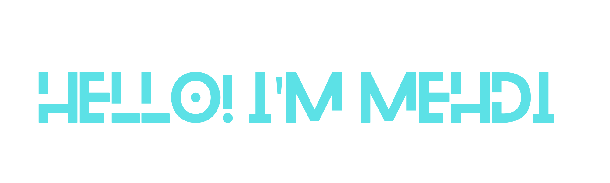

<ul>
  

<li><g-emoji class="g-emoji" >🔭</g-emoji> I’m currently working on <a href="https://github.com/aboussabr/Tripply" rel="nofollow">personal projects</a>!</li>
<li><g-emoji class="g-emoji">🌱</g-emoji>Develop my Flutter skill, Focusing on Performence & Secure Coding<g-emoji class="g-emoji" ></g-emoji></li>
<li><g-emoji class="g-emoji" >🥅</g-emoji> 2021 Goals: Improve Mobile Apps Portfolio & PlayStore Presence</li>
      

</ul>

<h3><a id="user-content-hi-there-" class="anchor" aria-hidden="true" href="#hi-there-"><svg class="octicon octicon-link" viewBox="0 0 16 16" version="1.1" width="16" height="16" aria-hidden="true"><path fill-rule="evenodd" d="M7.775 3.275a.75.75 0 001.06 1.06l1.25-1.25a2 2 0 112.83 2.83l-2.5 2.5a2 2 0 01-2.83 0 .75.75 0 00-1.06 1.06 3.5 3.5 0 004.95 0l2.5-2.5a3.5 3.5 0 00-4.95-4.95l-1.25 1.25zm-4.69 9.64a2 2 0 010-2.83l2.5-2.5a2 2 0 012.83 0 .75.75 0 001.06-1.06 3.5 3.5 0 00-4.95 0l-2.5 2.5a3.5 3.5 0 004.95 4.95l1.25-1.25a.75.75 0 00-1.06-1.06l-1.25 1.25a2 2 0 01-2.83 0z"></path></svg></a>Connect with me: <g-emoji class="g-emoji" alias="wave" fallback-src="https://github.githubassets.com/images/icons/emoji/unicode/1f44b.png"></g-emoji></h3>

<h3><a id="user-content-languages-and-tools" class="anchor" aria-hidden="true" href="#languages-and-tools"><svg class="octicon octicon-link" viewBox="0 0 16 16" version="1.1" width="16" height="16" aria-hidden="true"><path fill-rule="evenodd" d="M7.775 3.275a.75.75 0 001.06 1.06l1.25-1.25a2 2 0 112.83 2.83l-2.5 2.5a2 2 0 01-2.83 0 .75.75 0 00-1.06 1.06 3.5 3.5 0 004.95 0l2.5-2.5a3.5 3.5 0 00-4.95-4.95l-1.25 1.25zm-4.69 9.64a2 2 0 010-2.83l2.5-2.5a2 2 0 012.83 0 .75.75 0 001.06-1.06 3.5 3.5 0 00-4.95 0l-2.5 2.5a3.5 3.5 0 004.95 4.95l1.25-1.25a.75.75 0 00-1.06-1.06l-1.25 1.25a2 2 0 01-2.83 0z"></path></svg></a>Languages and Tools:</h3>

 

  

 

  

  
  </a>

